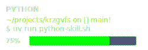
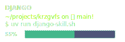
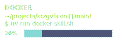
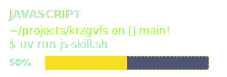
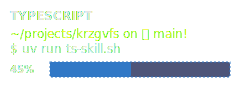
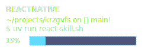
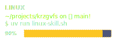

# Olá, eu sou Marcos!👋

  
  
  

**Desenvolvedor fullstack, entusiasta Opensource e criador de conteúdo sobre tecnologia. 🔗[Clique aqui](https://www.youtube.com/@krzgvfs)**

---
### Habilidades 🧪

---

### Sobre ℹ️
Sou movido pela curiosidade, com um interesse especial em Desenvolvimento, Sistemas Operacionais e Automações. Sempre que tenho um tempo, estou trabalhando em algum projeto pessoal ou simplesmente aprendendo algo novo que me fisgou.
- 👨‍💻 **Trabalho:** Desenvolvedor Full-stack Junior [Helpitech - Soluções em TI](https://helpitech.com.br)
- 🌍 **Localização:** São Paulo - Brasil
- 📚 **Estudando:** React Native, VueJS e DevOps
---

### Destaques ✨

  
<strong>📁 Commo - Sistema de PDV </strong>

   
  <em>Um sistema de Ponto de Venda (PDV) de código aberto, focado em simplicidade e eficiência para o pequeno comerciante.</em>
  <ul>
    <li><strong>Tecnologias:</strong> Python, Django, Vue3, Tailwind, Postgresql  </li>
    <li><strong>Status:</strong> Em desenvolvimento</li>
    <li>
      <a href="https://github.com/krzgvfs/todo-list">Ver no GitHub</a>  🔗
    </li>
  </ul>

  
<strong>📁 Todo-List - App de Tarefas</strong>

   
  <em>Uma aplicação simples de lista de tarefas para organizar o dia a dia, construída para estudos de React Native.</em>
  <ul>
    <li><strong>Tecnologias:</strong> Typescript, React Native</li>
    <li><strong>Status:</strong> Em desenvolvimento</li>
    <li>
      <a href="https://github.com/krzgvfs/todo-list">Ver no GitHub</a>  🔗
    </li>
  </ul>

---

### 📫 Contato

  
  
  
  

---

### Curiosidades 🥸
- Sou aficionado por jogos retrô e emulação.
- Leitor ávido de `SELECT * FROM books WHERE author='J.R.R. Tolkien'`.
- Minha top 3 GNU/Linux é Arch, Zorin e Debian.

  

  
  
  
  
  

